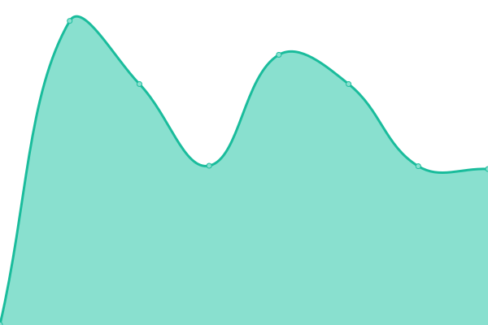
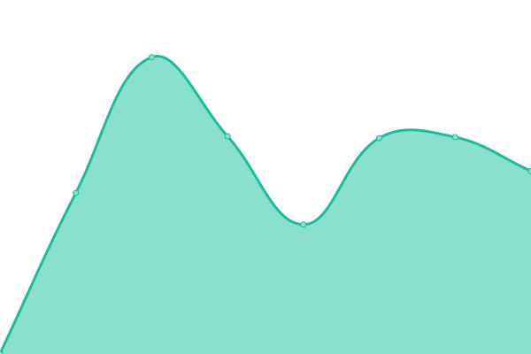

# [📈 Live Status](https://status.virtualbaw.com): <!--live status--> **🟧 Partial outage**

This repository contains the open-source uptime monitor and status page for [VirtualBAW](https://status.virtualbaw.com), powered by [Upptime](https://github.com/upptime/upptime).

With [Upptime](https://upptime.js.org), you can get your own unlimited and free uptime monitor and status page, powered entirely by a GitHub repository. We use [Issues](https://github.com/VirtualBAW/status-page/issues) as incident reports, [Actions](https://github.com/VirtualBAW/status-page/actions) as uptime monitors, and [Pages](https://status.virtualbaw.com) for the status page.

<!--start: status pages-->
<!-- This summary is generated by Upptime (https://github.com/upptime/upptime) -->
<!-- Do not edit this manually, your changes will be overwritten -->
<!-- prettier-ignore -->
| URL | Status | History | Response Time | Uptime |
| --- | ------ | ------- | ------------- | ------ |
|  [Website Frontend](https://virtualbaw.com) | 🟥 Down | [website-frontend.yml](https://github.com/VirtualBAW/status-page/commits/HEAD/history/website-frontend.yml) | 

 514ms
     
 | 

<a href="https://status.virtualbaw.com/history/website-frontend">0.00%</a>
    

|  [vAMSYS Dashboard](https://vamsys.io) | 🟩 Up | [v-amsys-dashboard.yml](https://github.com/VirtualBAW/status-page/commits/HEAD/history/v-amsys-dashboard.yml) | 

 601ms
     
 | 

<a href="https://status.virtualbaw.com/history/v-amsys-dashboard">100.00%</a>
    

|  [Support System](https://support.virtualbaw.com) | 🟩 Up | [support-system.yml](https://github.com/VirtualBAW/status-page/commits/HEAD/history/support-system.yml) | 

 476ms
     
 | 

<a href="https://status.virtualbaw.com/history/support-system">100.00%</a>
    

|  [Ventura Server](http://46.101.0.90) | 🟩 Up | [ventura-server.yml](https://github.com/VirtualBAW/status-page/commits/HEAD/history/ventura-server.yml) | 

 201ms
     
 | 

<a href="https://status.virtualbaw.com/history/ventura-server">100.00%</a>
    

<!--end: status pages-->

[**Visit our status website →**](https://status.virtualbaw.com)

## 📄 License

- Powered by: [Upptime](https://github.com/upptime/upptime)
- Code: [MIT](./LICENSE) © [VirtualBAW](https://status.virtualbaw.com)
- Data in the `./history` directory: [Open Database License](https://opendatacommons.org/licenses/odbl/1-0/)
